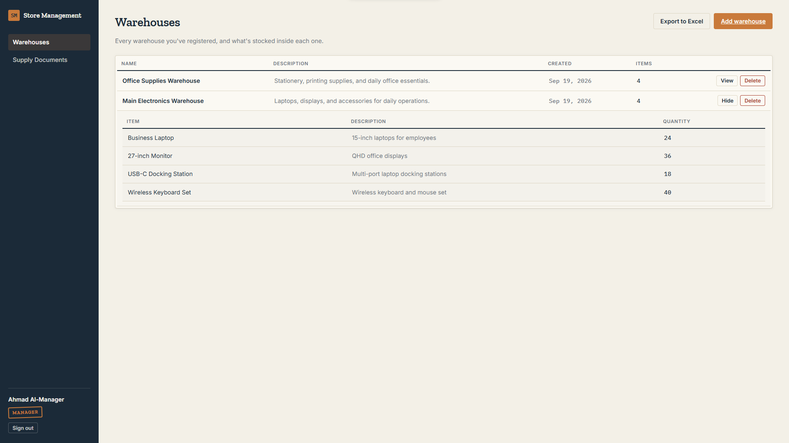
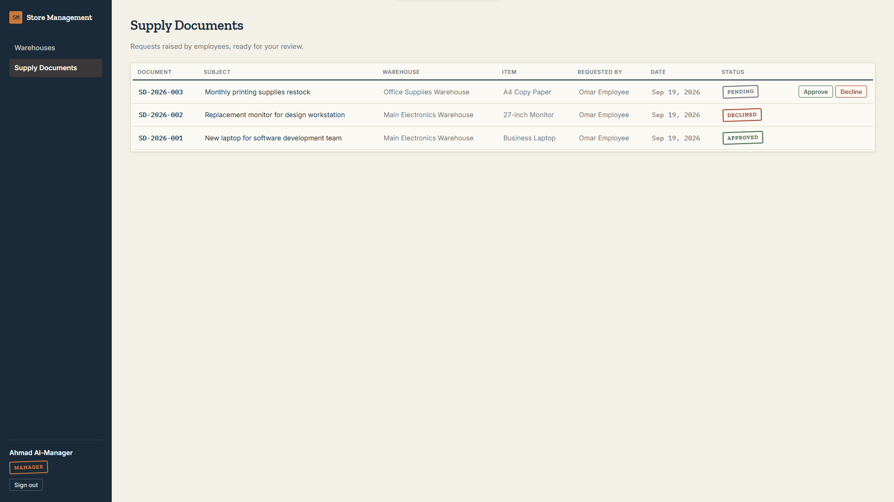
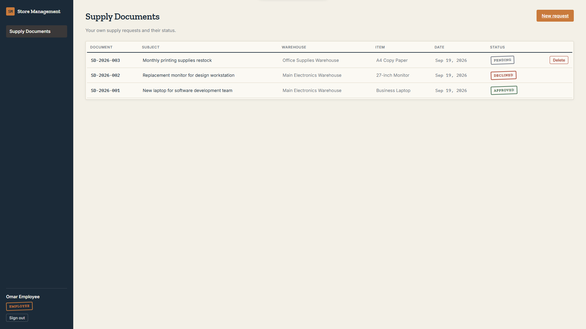

# Store Management System

A role-based full-stack system for managing warehouses, inventory items, supply documents, and Excel reports.

## Highlights

- JWT authentication for manager and employee accounts
- Warehouse and item management
- Supply-document workflows and status tracking
- Manager-only operations enforced by API authorization
- Excel exports
- Angular forms, route guards, interceptors, and unit tests
- Runtime configuration for all seed passwords and signing secrets

## Screenshots

### Warehouse inventory



### Supply-document workflow



### Employee request tracking



## Technology

- ASP.NET Core 10 Web API
- Entity Framework Core 10 and SQL Server
- Angular 22, TypeScript, RxJS, and Vitest
- ClosedXML

## Project structure

- `Api/StoreManagement` — API, migrations, seed logic, and services
- `UI/StoreManagement.Client` — Angular client

## Local setup

Prerequisites: .NET 10 SDK, SQL Server, Node.js, and npm.

1. Start the API:

   ```powershell
   cd Api\StoreManagement
   dotnet restore
   dotnet user-secrets set "Jwt:Key" "replace-with-a-random-secret-that-is-at-least-32-characters"
   dotnet user-secrets set "SeedUsers:Password" "choose-a-local-demo-password"
   dotnet run --launch-profile https
   ```

   The application applies its existing migration and creates sample users when the database is empty. Override `ConnectionStrings:ConnString` with user-secrets if the local SQL Server connection differs.

2. Start the client in another terminal:

   ```powershell
   cd UI\StoreManagement.Client
   npm ci
   npm start
   ```

3. Open `http://localhost:4200`. The client calls `https://localhost:7129/api`.

Seeded managers: `manager1`, `manager2`. Seeded employees: `employee1`, `employee2`, `employee3`. They use the password configured in `SeedUsers:Password`.

## Validation commands

```powershell
cd Api\StoreManagement
dotnet build

cd ..\..\UI\StoreManagement.Client
npm ci
npm test -- --watch=false
npm run build
```

Swagger is available at `https://localhost:7129/swagger` in Development. See `StoreManagement.http` for request examples.

## Security notes

Keep JWT keys, seed passwords, production connection strings, and environment-specific settings out of Git. For production, use HTTPS, a secret manager, strict CORS origins, least-privilege database credentials, and a migration/deployment process separate from application startup.

